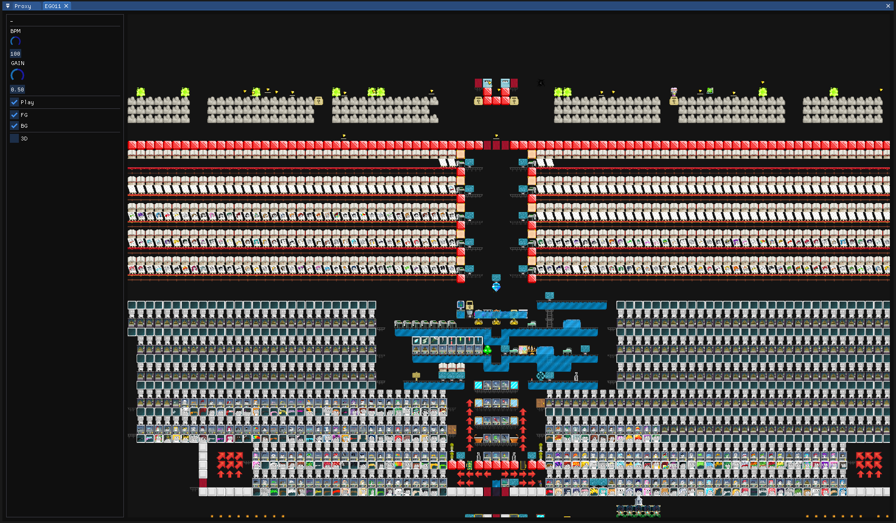
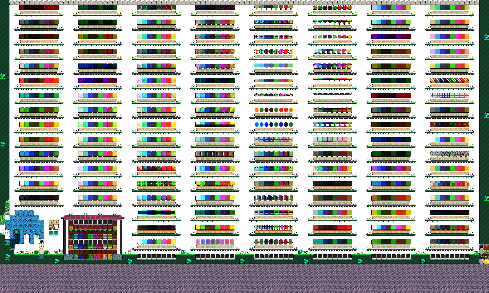
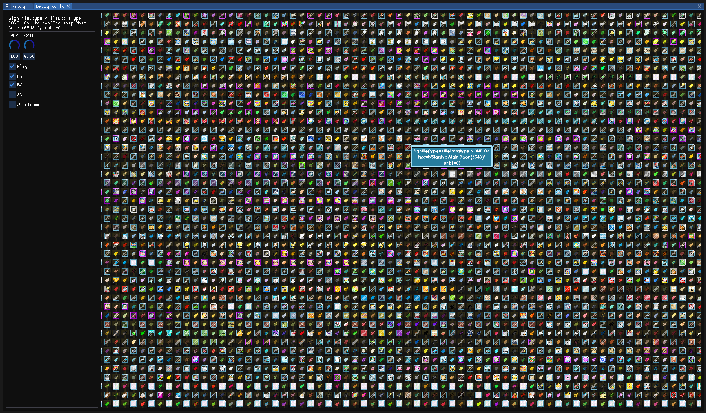
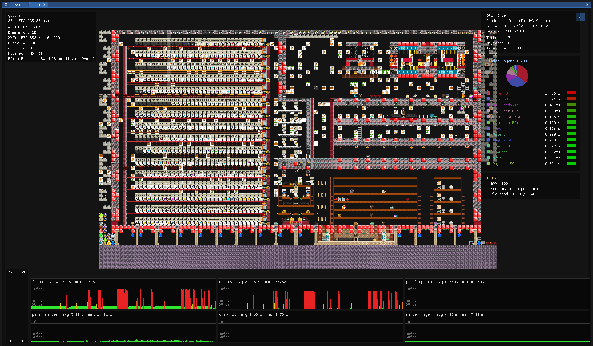

<table align="center" width="100%">
  <tr>
    <td align="center" width="50%">
      <p><b>Native GUI Using OpenGL</b></p>
      
    </td>
    <td align="center" width="50%">
      <p><b>Render to Image</b></p>
      
    </td>
  </tr>
  <tr>
    <td align="center" width="50%">
      <p><b>Debug World</b></p>
      
    </td>
    <td align="center" width="50%">
      <p><b>Debug UI</b></p>
      
    </td>
  </tr>
</table>


```
prerequisites:

- uv (https://docs.astral.sh/uv)

setup:

install python:
$ uv python install 3.13
(at least python >= 3.12)

$ uv venv --python 3.13
$ source .venv/bin/activate
(or `.\.venv\Scripts\activate` on windows)
$ uv sync
(use `uv sync --extra gui` if you want to use the gui)

usage:

help:
$ python main.py --help

to test connectivity:
$ python main.py test

to run the proxy:
$ python main.py proxy

to run the script:
use ./s <args> in linux or ./s.cmd <args> in windows,
or directly invoke scripts/cli.py (need to set env PYTHONPATH=.)

test:

to run the test
$ ./s test
or
$ pytest --forked -vv

see coverage report
$ ./s test -r

NOTE: set the environment variable `UPDATE=1` if you want to re-record the test output

to compile protobuf:
$ ./s compile-proto

extension:

extension is used to add more feature basically.
its in a separate process talking through a broker (router) using zmq and protobuf.
if you want to make your own extension, see the example in `extension/utils.py`

to run the extension:
simply run the script containing `Extension().start()` it will automatically register/wait to the proxy

to stop the extension:
simply ctrl+c, it will automatically unregister

broker/extension is restart-resistant, meaning it will automatically recover if any of them goes down
so you can safely interrupt to make some change
```
